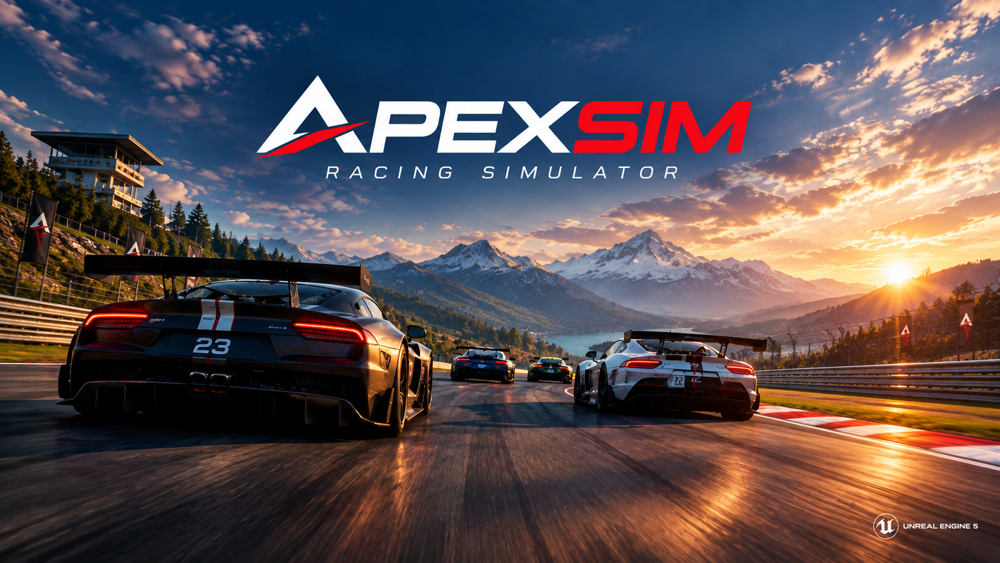

# [ApexSim](https://gdoct.github.io/apexsim/)

ApexSim is a source-available sim-racing platform: a high-frequency
authoritative server written in Rust and an Unreal Engine 5 client, with a
content pipeline that builds real-world circuits from public data.

[](https://gdoct.github.io/apexsim/)

The site at **https://gdoct.github.io/apexsim/** shows the cars, the
circuits and the game in motion.

## What it is

- **One simulation, on the server.** The server runs every car at 420 Hz: a
  four-wheel model with per-wheel loads, a slip-based tyre model with heat,
  wear and compounds, aero that depends on ride height and the air, fuel,
  brake and engine heat, damage, hybrids and slipstream. The client has no
  physics: every car, the player's included, is drawn from the server's
  telemetry. The simulation is deterministic, and a test holds it to
  bit-identical runs.
- **Racing.** Races over laps or time, qualifying that sets the grid, hotlaps
  with a ghost, pit stops, weather and time of day that change during a
  session, a track that rubbers in, AI drivers that pass, defend and plan
  stops, and force feedback worked out from the tyre forces.
- **Real circuits.** Every circuit is a measured centerline with real
  elevation, dressed from OpenStreetMap: its stands, buildings, pit lane,
  woods and barriers. The track pipeline bakes each circuit for the client,
  and the game builds it at runtime.
- **Moddable.** Cars are a `car.toml` plus models, the HUD is JSON components,
  and tracks and cars from a player's own Assetto Corsa install can be
  imported. See [MODDING.md](MODDING.md).

The project is in active development. What is not built yet is listed in
[docs/simulation-gaps.md](docs/simulation-gaps.md) and
[docs/roadmap.md](docs/roadmap.md).

## Playing

Download the latest zip from the
[releases page](https://github.com/gdoct/apexsim/releases), unzip it and run
`launcher.exe`. It starts the game, with a local server if you want one, and
edits the network and graphics settings. To host for others, run
`Server\apexsim-server.exe` ([docs/server/operations.md](docs/server/operations.md)).

## Building from source

You need Rust, Python 3 (numpy, Pillow, PyYAML) and Unreal Engine 5.8 on
Windows. In short:

```powershell
cd server; cargo run                       # the server (TCP 9000, UDP 9001, HTTP 9002)
./scripts/initialize_content.ps1           # build the generated content a fresh clone lacks
./scripts/play_editor.ps1 -Build           # build the client and play it from the editor build
./scripts/build_release.ps1 -Zip           # a release package
```

[docs/building.md](docs/building.md) has the details: the content stages,
tests, packaging and the engine lookup.

## Performance

Measured with `cargo bench --bench physics_tick` (release, one core, Monza):
one car's physics step takes about 2.4 µs, and a whole 8-car session tick
(physics, AI, collisions, timing) about 40 µs, under 2% of the 2.4 ms a
420 Hz tick allows.

## Repository

```
server/        Rust server: simulation, sessions, networking, admin dashboard
game-unreal/   Unreal Engine 5.8 client (C++ modules ApexSim, ApexSimNet, ApexSimInput, ApexSimBoot, ApexTrackEditor)
track-editor/  Rust track pipeline (track-core) and the Bevy scene editor
scripts/       build scripts, the Python content pipeline and the importers
content/       cars, tracks and HUD, shared by server, pipeline and client
launcher/      the Windows launcher shipped with releases
site/          the marketing site's source (generated into docs/)
docs/          documentation
```

## Documentation

[docs/README.md](docs/README.md) indexes it: architecture, building, the
server, the client and the content pipeline.

## Contributing

Coordinate significant changes in an issue first. Before a pull request:

```bash
cd server
cargo fmt && cargo clippy --all-targets   # CI enforces fmt --check and -D warnings
cargo test
```

Wire-format changes are made on both sides at once (`server/src/network.rs`
and `game-unreal/Source/ApexSimNet`) and pinned by golden bytes on both sides;
see [docs/server/protocol.md](docs/server/protocol.md). Keep the doc for the
area you change up to date.

## License

ApexSim is proprietary software released under the
[ApexSim Restricted Commercial License](LICENSE). You may run, read and modify
it for your own personal, non-commercial use; any commercial use,
redistribution or hosting as a service requires a separate commercial license.
See LICENSE for the terms and contact details.
